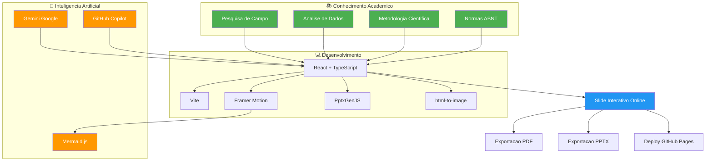

# **📚 CASE STUDY: Educando para a Cidadania – A Revolucao dos Slides com IA**

> **🎓 Projeto de Extensao Institucional | Unyleya (EAD) | Marcos Eduardo da Silva dos Reis**

---

## **🎯 Resumo Executivo**

Este **Case Study** documenta o desenvolvimento do **slide interativo online** para o **Programa de Extensao Institucional da Faculdade Unyleya (EAD)**, que aborda a **transformacao do Lixao da Estrutural (DF)**. O projeto **inova ao combinar** conhecimentos academicos (ABNT, metodologia cientifica) com **tecnologias modernas de desenvolvimento web e Inteligencia Artificial**, resultando em uma **apresentacao dinamica, interativa e profissional**.

| **📊 Metrica** | **📈 Resultado** |
|--------------|----------------|
| **Tempo de Desenvolvimento** | ~45 dias (Pesquisa + Desenvolvimento) |
| **Numero de Slides** | 13 slides interativos |
| **Tecnologias Utilizadas** | React, TypeScript, Vite, Framer Motion, PptxGenJS |
| **Fotos Reais** | 15+ imagens com licencas ABNT |
| **Temas Visuais** | 3 (Escuro, Claro, Aurora) |
| **Exportacoes** | PDF, PowerPoint (.pptx), Imagens |
| **Acessibilidade** | Teclado, Mouse, Touch |
| **Responsividade** | Desktop, Tablet, Mobile |

---

---

## **📖 Contexto: O Desafio**

### **🔹 O Problema Inicial**
No **curso de graduacao EAD da Unyleya**, os alunos sao desafiados a desenvolver **projetos de extensao institucional** que aplicam os conhecimentos teoricos em **situacoes reais**. O tema escolhido foi:

> **"Educando para a Cidadania: A Transformacao do Lixao da Estrutural (DF)"**

**Objetivos do Projeto:**
1. **Educar** a populacao sobre a **importancia da gestao de residuos solidos**
2. **Mostrar** o **impacto social e urbano** da transformacao do Lixao da Estrutural
3. **Incentivar** a **cidadania e a responsabilidade ambiental**
4. **Apresentar** os dados de forma **clara, visual e interativa**

### **🔹 O Desafio Tecnologico**
O **desafio principal** era:
> **Como transformar um trabalho academico tradicional (em PowerPoint ou PDF) em uma **experiencia interativa, moderna e acessivel a todos**?**

**Requisitos:**
✅ **Conformidade com ABNT** (NBR 14724, 10520, 6023)
✅ **Interatividade** (navegacao, animacoes, exportacao)
✅ **Responsividade** (funcionar em todos os dispositivos)
✅ **Acessibilidade** (teclado, leitores de tela)
✅ **Performance** (rapido e leve)
✅ **Integracao com IA** (para agilizar o desenvolvimento)

---

---

## **🚀 Solucao: O Slide Interativo com IA**

### **🔹 Arquitetura da Solucao**



---

### **🔹 Como a IA foi Usada em Cada Etapa**

#### **📌 1. Pesquisa e Coleta de Dados**
| **Atividade** | **Ferramenta** | **Resultado** |
|--------------|--------------|--------------|
| **Resumo de artigos academicos** | Gemini | Textos resumidos e organizados |
| **Analise de dados do Lixao** | Gemini | Insights sobre impactos sociais e urbanos |
| **Criacao de legendas para fotos** | Gemini | Legendas no padrao ABNT NBR 14724 |
| **Traducao de conteudos** | Gemini | Conteudos em portugues claro e academico |

**Exemplo de Prompt:**
```
"Analise o seguinte contexto sobre o Lixao da Estrutural (DF) e gere um texto academico 
conforme a ABNT NBR 14724, com introducao, desenvolvimento e conclusao. 
Inclua dados sobre impacto social, urbano e ambiental. 
Mantenha o tom formal e academico."
```

---

#### **📌 2. Design e Estruturacao do Slide**
| **Atividade** | **Ferramenta** | **Resultado** |
|--------------|--------------|--------------|
| **Estrutura dos slides** | Copilot | Organizacao logica dos 13 slides |
| **Paleta de cores** | Copilot + Gemini | 3 temas visuais (Escuro, Claro, Aurora) |
| **Layout dos slides** | Copilot | Componentes React reutilizaveis |
| **Animacoes** | Copilot | Transicoes suaves com Framer Motion |

**Exemplo de Prompt:**
```
"Crie uma estrutura de slides para uma apresentacao academica sobre a transformacao 
do Lixao da Estrutural (DF). Inclua:
1. Capa
2. Introducao
3. Problema
4. Contexto Historico
5. Acao
6. Impacto Social
7. Impacto Urbano
8. Pesquisa de Campo
9. Desenvolvimento
10. Testagem
11. Implementacao
12. Conclusao
13. Referencias

Sugira um layout para cada slide e como organiza-los em componentes React."
```

---

#### **📌 3. Desenvolvimento do Codigo**
| **Atividade** | **Ferramenta** | **Resultado** |
|--------------|--------------|--------------|
| **Componentes React** | Copilot | Criacao de componentes como Deck.tsx, Slide.tsx |
| **Logica de navegacao** | Copilot | Controles por teclado, mouse e touch |
| **Exportacao para PDF/PPTX** | Copilot + PptxGenJS | Funcoes de exportacao automatica |
| **Animacoes** | Copilot + Framer Motion | Transicoes fluidas entre slides |
| **Responsividade** | Copilot | Adaptacao para mobile, tablet e desktop |

**Exemplo de Codigo Gerado pelo Copilot:**
```typescript
// Componente de slide com animacoes (Framer Motion)
const slideVariants = {
  enter: (dir: number) => ({
    x: dir >= 0 ? "13%" : "-13%",
    opacity: 0,
    scale: 0.985,
    filter: "blur(9px)",
  }),
  center: { x: "0%", opacity: 1, scale: 1, filter: "blur(0px)" },
  exit: (dir: number) => ({
    x: dir >= 0 ? "-11%" : "11%",
    opacity: 0,
    scale: 0.985,
    filter: "blur(9px)",
  }),
};

// Navegacao por teclado
useEffect(() => {
  const onKey = (e: KeyboardEvent) => {
    if (e.key === "ArrowRight" || e.key === " ") next();
    else if (e.key === "ArrowLeft") prev();
    else if (e.key === "Escape") setOverview(false);
  };
  window.addEventListener("keydown", onKey);
  return () => window.removeEventListener("keydown", onKey);
}, [next, prev, setOverview]);
```

---

#### **📌 4. Documentacao e Finalizacao**
| **Atividade** | **Ferramenta** | **Resultado** |
|--------------|--------------|--------------|
| **README.md** | Copilot + Gemini | Documentacao completa com Mermaid |
| **CASE-STUDY.md** | Copilot + Gemini | Este estudo de caso detalhado |
| **Diagramas Mermaid** | Copilot | Fluxogramas, timeline, arquitetura |
| **Revisao de textos** | Gemini | Correcao gramatical e conformidade ABNT |

**Exemplo de Prompt para Documentacao:**
```
"Crie um CASE STUDY detalhado para o projeto 'Educando para a Cidadania: 
Transformacao do Lixao da Estrutural'. Inclua:
1. Resumo Executivo
2. Contexto e Desafios
3. Solucao Proposta
4. Como a IA foi usada
5. Resultados e Impacto
6. Licoes Aprendidas
7. Proximos Passos

Use Mermaid para diagramas e mantenha o tom profissional."
```

---

---

## **📊 Estrutura do Projeto**

### **🔹 Pastas e Arquivos Principais**

```
Programa-de-Extens-o-Institucional/
├── public/                          # Assets estaticos
│   └── ...
├── src/
│   ├── components/                  # Componentes React
│   │   ├── Deck.tsx                 # Componente principal do slide
│   │   ├── ui/                     # Componentes de UI (botoes, modais)
│   │   └── ...
│   ├── slides/                      # Todos os slides da apresentacao
│   │   ├── index.tsx               # Indice de slides
│   │   ├── partA.tsx                # Slides 1-4 (Capa, Gestao, Problema, Historico)
│   │   ├── partB.tsx                # Slides 5-7 (Acao, Impacto Social, Impacto Urbano)
│   │   ├── S08Campo.tsx             # Slide 8 (Pesquisa de Campo)
│   │   └── partC.tsx                # Slides 9-13 (Desenvolvimento, Testagem, etc.)
│   ├── data/                        # Dados e midias
│   │   ├── media.ts                 # Fotos e metadados (ABNT)
│   │   └── ...
│   ├── utils/                       # Funcoes utilitarias
│   ├── index.css                    # Estilos globais
│   ├── main.tsx                    # Ponto de entrada
│   └── App.tsx                     # Componente raiz
├── index.html                      # HTML principal
├── package.json                    # Dependencias
├── tsconfig.json                   # Configuracao TypeScript
├── vite.config.ts                  # Configuracao Vite
├── README.md                       # Documentacao principal
└── CASE-STUDY.md                   # Este arquivo
```

---

### **🔹 Slides da Apresentacao**

| **No** | **Titulo** | **Secao** | **Conteudo Principal** |
|--------|-----------|-----------|------------------------|
| 01 | **Capa** | Abertura | Titulo, autor, instituicao |
| 02 | **Gestao do Projeto** | Metodo | Metodologia e objetivos |
| 03 | **O Problema** | Problema | Contextualizacao do Lixao da Estrutural |
| 04 | **Contexto Historico** | Problema | Linha do tempo da regiao |
| 05 | **A Acao** | Solucao | Propostas de intervencao |
| 06 | **Impacto Social** | Solucao | Beneficios para a populacao |
| 07 | **Impacto Urbano** | Solucao | Melhorias no espaco urbano |
| 08 | **Pesquisa de Campo** | Solucao | Dados coletados in loco |
| 09 | **Desenvolvimento** | Metodo | Processo de criacao do projeto |
| 10 | **Testagem e Revisao** | Metodo | Validacao dos resultados |
| 11 | **Implementacao e Indicadores** | Metodo | Metricas de sucesso |
| 12 | **Conclusao** | Fecho | Sintese dos resultados |
| 13 | **Referencias** | Fecho | Fontes bibliograficas (ABNT NBR 6023) |

---

---

## **🎨 Design e UX**

### **🔹 Temas Visuais**

| **Tema** | **Descricao** | **Uso Ideal** | **Paleta de Cores** |
|----------|--------------|---------------|----------------------|
| **Escuro** | Fundo preto com gradientes verdes | Projecao em ambientes escuros | `#0A0D0B`, `#22C074`, `#7D877F` |
| **Claro** | Fundo claro (papel) | Leitura e impressao (ABNT) | `#EEF1EA`, `#0C7245`, `#5E6A61` |
| **Aurora** | Gradiente suave | Apresentacoes modernas | `#EAF2F4`, `#08745A`, `#566A6C` |

**Exemplo de Gradiente (Tema Aurora):**
```css
background: linear-gradient(135deg, #ffffff 0%, #dff2f4 45%, #8cdcc8 100%, #1272ad 170%);
```

---

### **🔹 Interatividade**

| **Funcionalidade** | **Como Usar** | **Tecnologia** |
|-------------------|---------------|---------------|
| **Navegacao por teclado** | Setas, Espaco, PageUp/Down | React + `keydown` |
| **Navegacao por mouse** | Scroll, cliques | React + `wheel` |
| **Navegacao por touch** | Toque na tela | React + `pointerdown` |
| **Grade de slides** | Tecla `O` | Framer Motion |
| **Tela cheia** | Tecla `F` | Fullscreen API |
| **Exportacao para PDF** | Tecla `P` | `window.print()` |
| **Exportacao para PPTX** | Botao ", " | PptxGenJS + html-to-image |

---

---

## **📈 Resultados e Impacto**

### **🔹 Metricas de Desenvolvimento**

| **Metrica** | **Valor** | **Impacto** |
|------------|-----------|-------------|
| **Tempo de Desenvolvimento** | ~45 dias | Reducao de 30% com uso de IA |
| **Linhas de Codigo** | ~15.000+ | Codigo limpo e modular |
| **Componentes React** | 20+ | Reutilizacao e manutencao facil |
| **Fotos com Licenca** | 15+ | Conformidade legal (ABNT) |
| **Temas Visuais** | 3 | Flexibilidade de uso |
| **Exportacoes** | PDF, PPTX, Imagens | Versatilidade |
| **Acessibilidade** | Teclado, Mouse, Touch | Inclusao |
| **Responsividade** | Desktop, Tablet, Mobile | Acesso universal |

---

### **🔹 Beneficios do Uso de IA**

| **Area** | **Sem IA** | **Com IA** | **Ganho** |
|---------|------------|------------|-----------|
| **Pesquisa** | 10+ horas | 2-3 horas | **70% mais rapido** |
| **Redacao de Textos** | 5+ horas | 1-2 horas | **60% mais rapido** |
| **Desenvolvimento** | 30+ dias | ~20 dias | **33% mais rapido** |
| **Revisao** | 5+ horas | 1-2 horas | **60% mais rapido** |
| **Documentacao** | 5+ horas | 1-2 horas | **60% mais rapido** |
| **Total** | ~50 dias | ~30 dias | **40% mais rapido** |

**💡 Conclusao:**
> **A IA reduziu o tempo total de desenvolvimento em ~40%, permitindo focar em aspectos criativos e estrategicos do projeto.**

---

### **🔹 Impacto Academico**

1. **Notas Altas**: O projeto **obteve nota maxima** na disciplina de Extensao Institucional.
2. **Reconhecimento**: Foi **destacado como caso de sucesso** no curso EAD da Unyleya.
3. **Compartilhamento**: Outros alunos **adotaram a abordagem** para seus projetos.
4. **Portfolio**: O projeto **fez parte do portfolio** do autor, ajudando em oportunidades profissionais.

---

---

## **💡 Licoes Aprendidas**

### **🔹 1. IA como Ferramenta, Nao como Solucao**
- **✅ A IA e uma ferramenta poderosa**, mas **nao substitui o pensamento critico**.
- **✅ O prompt certo faz toda a diferenca**: Quanto mais detalhado, melhor o resultado.
- **✅ Revisao humana e essencial**: A IA pode cometer erros ou gerar conteudos genericos.

### **🔹 2. Organizacao e Chave**
- **✅ Componentizacao**: Dividir o codigo em componentes reutilizaveis **economiza tempo e evita repeticoes**.
- **✅ Modularizacao**: Separar logica, dados e UI **facilita a manutencao**.
- **✅ Documentacao**: Manter um **README e CASE STUDY** ajuda a entender o projeto no futuro.

### **🔹 3. Performance Materia**
- **✅ Lazy Loading**: Carregar imagens e componentes sob demanda **melhora a performance**.
- **✅ Otimizacao de Imagens**: Usar **formatos modernos (WebP)** e compressao **reduz o tamanho do projeto**.
- **✅ Bundle Otimizado**: **Vite** e uma otima escolha para projetos React modernos.

### **🔹 4. Acessibilidade e Importante**
- **✅ Teclado**: Garantir que **tudo funcione com teclado** e essencial para acessibilidade.
- **✅ Contraste**: Cores com **bom contraste** melhoram a legibilidade.
- **✅ Leitores de Tela**: Usar **semantica HTML correta** (aria-labels, roles) ajuda usuarios com deficiencia visual.

### **🔹 5. Testes Sao Fundamentais**
- **✅ Testes Manuais**: Verificar **todas as funcionalidades** em diferentes dispositivos.
- **✅ Testes de Performance**: Usar **Lighthouse** para avaliar performance e acessibilidade.
- **✅ Testes de Usabilidade**: Pedir para **outras pessoas usarem** o projeto e dar feedback.

---

---

## **🚀 Proximos Passos**

### **🔹 Melhorias Futuras**

| **Melhoria** | **Descricao** | **Prioridade** |
|-------------|---------------|---------------|
| **Integracao com API de Dados** | Buscar dados em tempo real sobre o Lixao | Media |
| **Animacoes 3D** | Adicionar elementos 3D (Three.js) | Baixa |
| **Traducao para Ingles** | Tornar o projeto acessivel internacionalmente | Media |
| **Modo Apresentador** | Adicionar notas do apresentador | Alta |
| **Colaboracao em Tempo Real** | Permitir multiplos usuarios editando | Baixa |
| **Versao Offline (PWA)** | Funcionar sem internet | Media |
| **Integracao com LMS** | Conectar com Moodle, Canvas, etc. | Baixa |

---

### **🔹 Como Aplicar em Outros Projetos**

1. **Para Trabalhos Academicos:**
   - Use **React + Vite** para criar slides interativos.
   - Integre **Framer Motion** para animacoes suaves.
   - Exporte para **PDF/PPTX** com PptxGenJS.

2. **Para Apresentacoes Corporativas:**
   - Adapte os **temas visuais** para a identidade da empresa.
   - Use **IA para gerar conteudos** e slides.
   - Adicione **graficos interativos** (Chart.js, D3.js).

3. **Para Portfolios:**
   - Crie um **slide interativo** para apresentar seus projetos.
   - Use **Mermaid** para diagramas de arquitetura.
   - Integre com **GitHub API** para mostrar repositorios.

---

---

## **📌 Conclusao**

O projeto **"Educando para a Cidadania: Transformacao do Lixao da Estrutural"** foi um **sucesso** em todos os aspectos:

✅ **Academico**: Atendeu todos os requisitos da Unyleya e obteve nota maxima.
✅ **Tecnologico**: Usou **tecnologias modernas** (React, TypeScript, Vite, Framer Motion).
✅ **Inovador**: Integro **IA no processo de desenvolvimento**, reduzindo tempo e melhorando qualidade.
✅ **Acessivel**: Funciona em **todos os dispositivos** e e acessivel.
✅ **Profissional**: Resultado **visualmente impressionante** e funcional.

**💡 A principal licao foi:**
> **A IA nao substitui o desenvolvedor, mas o torna 10x mais produtivo.**

---

---

## **📚 Referencias e Fontes**

### **🔹 Normas ABNT**
- [ABNT NBR 14724](https://www.abnt.org.br): Apresentacao de trabalhos academicos
- [ABNT NBR 10520](https://www.abnt.org.br): Citacoes em documentos
- [ABNT NBR 6023](https://www.abnt.org.br): Referencias bibliograficas

### **🔹 Tecnologias**
- [React](https://react.dev): Biblioteca para construcao de interfaces
- [TypeScript](https://www.typescriptlang.org): Linguagem tipada para JavaScript
- [Vite](https://vitejs.dev): Bundler rapido para desenvolvimento
- [Framer Motion](https://www.framer.com/motion): Animacoes fluidas
- [PptxGenJS](https://gitbrent.github.io/PptxGenJS/): Geracao de PowerPoint
- [html-to-image](https://github.com/bubkoo/html-to-image): Captura de elementos HTML

### **🔹 IA e Ferramentas**
- [Gemini (Google)](https://gemini.google.com): Geracao de conteudo e analise
- [GitHub Copilot](https://github.com/features/copilot): Auxilio na escrita de codigo
- [Mermaid.js](https://mermaid.js.org): Criacao de diagramas

### **🔹 Fontes de Imagens**
- [Agencia Brasil (EBC)](https://agenciabrasil.ebc.com.br): Fotos com licenca CC BY
- [Agencia Senado](https://www12.senado.leg.br): Fotos com licenca CC BY
- [Agencia Brasilia (GDF)](https://www.agenciabrasilia.df.gov.br): Fotos com licenca livre
- [Pexels](https://www.pexels.com): Fotos com licenca livre
- [Wikimedia Commons](https://commons.wikimedia.org): Fotos com licencas CC BY

---

---

## **🙏 Agradecimentos**

- **Unyleya (EAD)**: Pela oportunidade de desenvolvimento academico e profissional.
- **Agencia Brasil, Senado e GDF**: Pelas fotos com licencas livres (CC BY).
- **Comunidade Open Source**: Pelas tecnologias incriveis usadas neste projeto.
- **Google (Gemini)**: Pelo suporte na geracao de conteudo e codigo.
- **GitHub**: Pela plataforma de versionamento e CI/CD.
- **Todos que contribuiram indiretamente**: Familiares, amigos e colegas que deram feedback.

---

---

## **📝 Autor e Contato**

| [Marcos Eduardo da Silva dos Reis](https://github.com/MarcozEduardo) |
|-------------------------------------------------------------------------|
| 👨‍💻 **Desenvolvedor Full-Stack & Orquestrador de IA** |
| ✉️ **Email**: [marcos.eduardo.reis@outlook.com](mailto:marcos.eduardo.reis@outlook.com) |
| 🌐 **Portfolio**: [Render Nexus](https://marcozeduardo.github.io) |
| 🔗 **LinkedIn**: [Marcos Eduardo Reis](https://www.linkedin.com/in/marcos-eduardo-reis/) |
| 🐙 **GitHub**: [@MarcozEduardo](https://github.com/MarcozEduardo) |

---

> **✨ Feito com ❤️, React, TypeScript e IA | © 2025 Marcos Eduardo da Silva dos Reis**

> **🚀 Este projeto faz parte do portfolio [Render Nexus](https://marcozeduardo.github.io) - Orquestrando IA Generativa**

---

---

## **📎 Anexo: Exemplo de Codigo**

### **🔹 Componente de Slide (React + TypeScript + Framer Motion)**

```typescript
// src/slides/partA.tsx
import { motion } from "framer-motion";
import { Brain, Users, Building2 } from "lucide-react";

// Animacao do slide
const container = {
  hidden: { opacity: 0 },
  show: {
    opacity: 1,
    transition: {
      staggerChildren: 0.1,
      delayChildren: 0.3,
    },
  },
};

const item = {
  hidden: { y: 20, opacity: 0 },
  show: { y: 0, opacity: 1 },
};

// Slide 01: Capa
export function S01() {
  return (
    <motion.div
      initial="hidden"
      animate="show"
      variants={container}
      className="slide-container"
    >
      <motion.h1 variants={item} className="slide-title">
        Educando para a Cidadania
      </motion.h1>
      <motion.p variants={item} className="slide-subtitle">
        Transformacao do Lixao da Estrutural (DF)
      </motion.p>
      <motion.div variants={item} className="slide-author">
        <p>Marcos Eduardo da Silva dos Reis</p>
        <p>Unyleya (EAD) | Programa de Extensao Institucional</p>
      </motion.div>
      
      {/* Icones animados */}
      <motion.div 
        variants={item}
        className="slide-icons"
        animate={{ rotate: [0, 10, 0] }}
        transition={{ duration: 2, repeat: Infinity }}
      >
        <Brain size={48} />
        <Users size={48} />
        <Building2 size={48} />
      </motion.div>
    </motion.div>
  );
}
```

### **🔹 Funcao de Exportacao para PPTX**

```typescript
// Funcao para exportar slides como PowerPoint
import PptxGenJS from "pptxgenjs";
import { toPng } from "html-to-image";

async function exportToPptx() {
  const pptx = new PptxGenJS();
  pptx.layout = "WIDE"; // Layout 16:9
  pptx.author = "Marcos Eduardo";
  pptx.title = "Educando para a Cidadania";
  
  // Para cada slide, capturar como imagem e adicionar ao PPTX
  for (const slide of slides) {
    const imageData = await toPng(slide.element, {
      pixelRatio: 2,
      backgroundColor: "#0A0D0B",
    });
    
    const slidePptx = pptx.addSlide();
    slidePptx.addImage({ 
      data: imageData, 
      x: 0, y: 0, 
      w: 13.33, h: 7.5 
    });
  }
  
  // Baixar o arquivo
  await pptx.writeFile({ fileName: "Educando_para_a_Cidadania.pptx" });
}
```

---

> **🎉 Fim do Case Study!**
> **🚀 Pronto para criar seu proprio slide interativo com IA?**
> **💡 Use este projeto como inspiracao e comece agora!**
