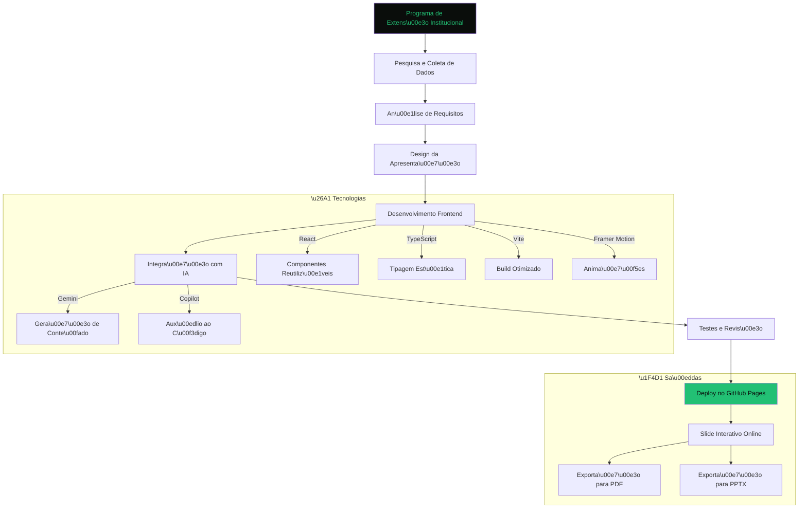
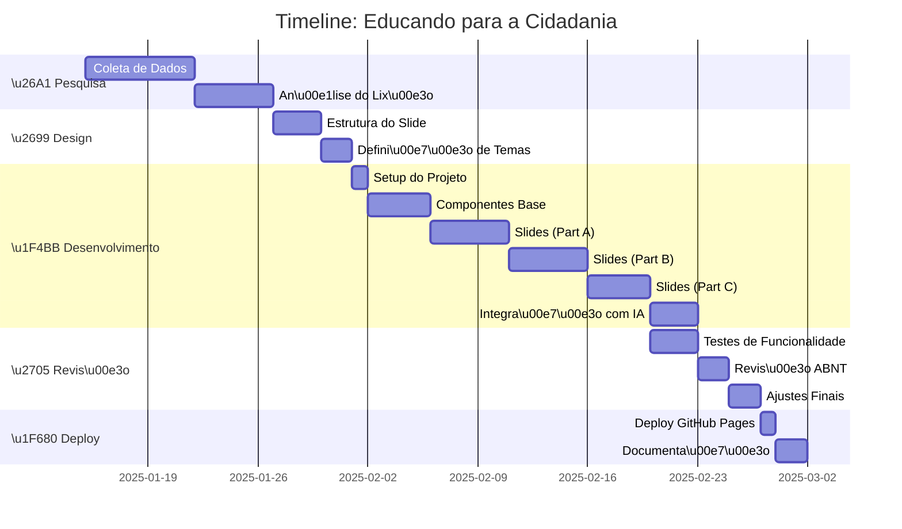

# 🎓 **Educando para a Cidadania: Transforma\u00e7\u00e3o do Lix\u00e3o da Estrutural (DF)**

> **📌 Projeto de Extens\u00e3o Institucional | Unyleya (EAD) | Marcos Eduardo da Silva dos Reis**

[](https://github.com/MarcozEduardo/Programa-de-Extens-o-Institucional/blob/main/LICENSE.MD)
[](https://react.dev)
[](https://www.typescriptlang.org)
[](https://vitejs.dev)
[](https://www.framer.com/motion)
[](https://www.abnt.org.br)

---

## **\u2728 Sobre o Projeto**

Este \u00e9 um **slide interativo online** desenvolvido como parte do **Programa de Extens\u00e3o Institucional da Faculdade Unyleya (EAD)**, que aborda a **transforma\u00e7\u00e3o do Lix\u00e3o da Estrutural (DF)**. O projeto combina **conhecimentos acad\u00eamicos** (ABNT, metodologia cient\u00edfica, gest\u00e3o de projetos) com **tecnologias modernas de desenvolvimento web** e **Intelig\u00eancia Artificial** para criar uma experi\u00eancia de apresenta\u00e7\u00e3o \u00fanica e profissional.

| **\u2705 O que \u00e9?** | **\u2192 Objetivo** | **\u1F4D1 P\u00fablico Alvo** |
|--------------------------|----------------------|----------------------|
| Slide interativo online | Demonstrar a transforma\u00e7\u00e3o social e urbana do Lix\u00e3o da Estrutural | Alunos, professores, gestores p\u00fablicos e comunidade acad\u00eamica |
| Apresenta\u00e7\u00e3o acad\u00eamica (ABNT) | Educar para a cidadania atrav\u00e9s de casos reais | Institui\u00e7\u00f5es de ensino e \u00f3rg\u00e3os p\u00fablicos |
| Ferramenta de visualiza\u00e7\u00e3o de dados | Mostrar impactos sociais e urbanos | Pesquisadores e formuladores de pol\u00edticas |

---

## **\u1F4A1 Demo ao Vivo**

> **\u25B6 [Acesse a Apresenta\u00e7\u00e3o Interativa](https://marcozeduardo.github.io/Programa-de-Extens-o-Institucional/)**

\u2705 **Funcionalidades:**
- \u27A1 Navega\u00e7\u00e3o por slides com **anima\u00e7\u00f5es suaves** (Framer Motion)
- \u27A1 **3 temas visuais** (Escuro, Claro, Aurora) 
- \u27A1 **Modo tela cheia** e **grade de slides** (O)
- \u27A1 **Exporta\u00e7\u00e3o para PDF** (impress\u00e3o) e **PowerPoint (.pptx)**
- \u27A1 **Fotos reais** (Ag\u00eancia Brasil, Senado, GDF) com licen\u00e7as ABNT
- \u27A1 **Responsivo** (funciona em desktop, tablet e mobile)
- \u27A1 **Controles por teclado** (setas, F para tela cheia, P para PDF)

---

## **\u1F914 Tecnologias Utilizadas**

### **\u26A1 Frontend**
| Tecnologia | Descri\u00e7\u00e3o | Vers\u00e3o |
|------------|------------|---------|
| **[React](https://react.dev)** | Biblioteca para constru\u00e7\u00e3o de interfaces | 18+ |
| **[TypeScript](https://www.typescriptlang.org)** | Linguagem tipada para JavaScript | 5+ |
| **[Vite](https://vitejs.dev)** | Bundler r\u00e1pido para desenvolvimento | 4+ |
| **[Framer Motion](https://www.framer.com/motion)** | Anima\u00e7\u00f5es fluidas | 10+ |
| **[PptxGenJS](https://gitbrent.github.io/PptxGenJS/)** | Gera\u00e7\u00e3o de PowerPoint (.pptx) | Latest |
| **[html-to-image](https://github.com/bubkoo/html-to-image)** | Captura de slides como imagens | Latest |
| **[Lucide React](https://lucide.dev)** | \u00cdcones modernas e leves | Latest |

### **\u1F5A6 Ferramentas de IA**
| Ferramenta | Uso no Projeto |
|------------|---------------|
| **[Gemini (Google)](https://gemini.google.com)** | Gera\u00e7\u00e3o de conte\u00fado, revis\u00e3o de textos, sugest\u00f5es de estrutura |
| **[GitHub Copilot](https://github.com/features/copilot)** | Aux\u00edlio na escrita de c\u00f3digo (React, TypeScript) |
| **[Mermaid.js](https://mermaid.js.org)** | Cria\u00e7\u00e3o de diagramas (usado neste README) |

### **\u1F4D2 Metodologia Acad\u00eamica**
- **ABNT NBR 14724**: Formata\u00e7\u00e3o de trabalhos acad\u00eamicos
- **ABNT NBR 10520**: Cita\u00e7\u00f5es em documentos
- **ABNT NBR 6023**: Refer\u00eancias bibliogr\u00e1ficas

---

## **\u1F680 Arquitetura do Projeto**



---

## **\u1F468 Timeline do Desenvolvimento**



---

## **\u1F4C3 Estrutura de Pastas**

```
Programa-de-Extens-o-Institucional/
├── public/                  # Assets est\u00e1ticos
├── src/
│   ├── components/          # Componentes React reutiliz\u00e1veis
│   │   ├── Deck.tsx         # Componente principal do slide
│   │   ├── ui/             # Componentes de UI (bot\u00f5es, modais)
│   │   └── ...
│   ├── slides/              # Todos os slides da apresenta\u00e7\u00e3o
│   │   ├── index.tsx       # \u00cdndice de slides
│   │   ├── partA.tsx        # Slides 1-4 (Capa, Gest\u00e3o, Problema, Hist\u00f3rico)
│   │   ├── partB.tsx        # Slides 5-7 (A\u00e7\u00e3o, Impacto Social, Impacto Urbano)
│   │   ├── S08Campo.tsx     # Slide 8 (Pesquisa de Campo)
│   │   └── partC.tsx        # Slides 9-13 (Desenvolvimento, Testagem, Implementa\u00e7\u00e3o, Conclus\u00e3o, Refer\u00eancias)
│   ├── data/                # Dados e m\u00eddias
│   │   ├── media.ts         # Fotos e metadados (ABNT)
│   │   └── ...
│   ├── utils/               # Fun\u00e7\u00f5es utilit\u00e1rias
│   ├── index.css            # Estilos globais
│   ├── main.tsx            # Ponto de entrada
│   └── App.tsx             # Componente raiz
├── index.html              # HTML principal
├── package.json            # Depend\u00eancias
├── tsconfig.json           # Configura\u00e7\u00e3o TypeScript
├── vite.config.ts          # Configura\u00e7\u00e3o Vite
├── README.md               # \u0019este arquivo
└── CASE-STUDY.md           # Estudo de Caso Detalhado
```

---

## **\u2728 Como Rodar Localmente**

### **\u25B6 Pr\u00e9-requisitos**
- [Node.js](https://nodejs.org) (v18 ou superior)
- [Git](https://git-scm.com) (opcional)
- Navegador moderno (Chrome, Firefox, Edge)

### **\u2B07 Instala\u00e7\u00e3o**
```bash
# 1. Clone o reposit\u00f3rio
 git clone https://github.com/MarcozEduardo/Programa-de-Extens-o-Institucional.git
 cd Programa-de-Extens-o-Institucional

# 2. Instale as depend\u00eancias
 npm install

# 3. Inicie o servidor de desenvolvimento
 npm run dev
```

### **\u25B6 Acesse a Apresenta\u00e7\u00e3o**
Abra o navegador e v\u00e1 para:
```
http://localhost:5173
```

---

## **\u1F3F7 Funcionalidades do Slide**

### **\u26A1 Navega\u00e7\u00e3o**
| A\u00e7\u00e3o | Teclas | Descri\u00e7\u00e3o |
|--------|--------|-------------|
| Pr\u00f3ximo Slide | \u2192 / Espa\u00e7o / PageDown | Avan\u00e7a para o pr\u00f3ximo slide |
| Slide Anterior | \u2190 / PageUp | Volta para o slide anterior |
| In\u00edcio | Home | V\u00e1 para o primeiro slide |
| Fim | End | V\u00e1 para o \u00faltimo slide |
| Grade de Slides | O | Abre a grade de slides |
| Tela Cheia | F | Ativa o modo tela cheia |
| Exportar PDF | P | Abre o modo impress\u00e3o/PDF |

### **\u1F504 Temas Visuais**
| Tema | Descri\u00e7\u00e3o | Ideal para |
|------|------------|-------------|
| **Escuro** | Fundo preto com gradientes verdes | Proje\u00e7\u00e3o em ambientes escuros |
| **Claro** | Fundo claro (ABNT) | Leitura e impress\u00e3o |
| **Aurora** | Gradiente suave | Apresenta\u00e7\u00f5es modernas |

### **\u1F4BE Exporta\u00e7\u00e3o**
- **PDF**: Impress\u00e3o em A4 paisagem (1 slide por p\u00e1gina)
- **PowerPoint (.pptx)**: Baixe a apresenta\u00e7\u00e3o completa com fotos
- **Imagens**: Captura de slides individuais

---

## **\u1F926 Como a IA Ajudou no Desenvolvimento**

### **\u2705 1. Gera\u00e7\u00e3o de Conte\u00fado**
- **Gemini** foi usado para:
  - Redigir **textos acad\u00eamicos** (introdu\u00e7\u00e3o, conclus\u00e3o)
  - Criar **descri\u00e7\u00f5es de slides** com base em t\u00f3picos
  - Gerar **legendas para fotos** (ABNT NBR 14724)
  - Traduzir e **revisar textos** para conformidade acad\u00eamica

### **\u2705 2. Aux\u00edlio ao C\u00f3digo**
- **GitHub Copilot** ajudou em:
  - **Componentes React** (estrutura, props, hooks)
  - **Anima\u00e7\u00f5es com Framer Motion** (transi\u00e7\u00f5es, variants)
  - **L\u00f3gica de exporta\u00e7\u00e3o** (PPTX, PDF)
  - **Fun\u00e7\u00f5es utilit\u00e1rias** (manipula\u00e7\u00e3o de dados, formata\u00e7\u00e3o)

### **\u2705 3. Design e UX**
- **Sugest\u00f5es de layout** para slides
- **Paleta de cores** baseada em temas acad\u00eamicos
- **Estrutura de navega\u00e7\u00e3o** (teclado, mouse, touch)

### **\u2705 4. Documenta\u00e7\u00e3o**
- **Gera\u00e7\u00e3o de README.md** (este arquivo!)
- **Cria\u00e7\u00e3o de CASE-STUDY.md** (estudo de caso detalhado)
- **Diagramas Mermaid** (fluxogramas, timeline)

---

## **\u1F4DD O que Aprendi com Este Projeto**

### **\u26A1 Conhecimentos T\u00e9cnicos**
- **React + TypeScript**: Constru\u00e7\u00e3o de aplica\u00e7\u00f5es complexas com tipagem forte
- **Framer Motion**: Anima\u00e7\u00f5es suaves e intera\u00e7\u00f5es fluidas
- **Vite**: Configura\u00e7\u00e3o de build e otimiza\u00e7\u00e3o de performance
- **PptxGenJS**: Gera\u00e7\u00e3o din\u00e2mica de PowerPoint
- **html-to-image**: Captura de elementos HTML como imagens

### **\u2699 Metodologia de Desenvolvimento**
- **ABNT**: Aplica\u00e7\u00e3o de normas acad\u00eamicas em projetos digitais
- **GitHub Pages**: Deploy cont\u00ednuo e gratuito
- **Componentiza\u00e7\u00e3o**: Organiza\u00e7\u00e3o de c\u00f3digo modular
- **Responsividade**: Adapta\u00e7\u00e3o para todos os dispositivos

### **\u1F916 Integra\u00e7\u00e3o com IA**
- **Prompt Engineering**: Como criar prompts efetivos para IA
- **Revis\u00e3o de C\u00f3digo**: Uso de IA para melhorar qualidades de c\u00f3digo
- **Gera\u00e7\u00e3o de Conte\u00fado**: Automa\u00e7\u00e3o de textos acad\u00eamicos
- **Documenta\u00e7\u00e3o Autom\u00e1tica**: Cria\u00e7\u00e3o de documenta\u00e7\u00e3o com IA

---

## **\u1F3E2 Contribui\u00e7\u00f5es**

Contribui\u00e7\u00f5es s\u00e3o bem-vindas! Sinta-se \u00e0 livre para:
- \u2705 Reportar bugs
- \u2705 Sugerir melhorias
- \u2705 Adicionar novos recursos
- \u2705 Melhorar a documenta\u00e7\u00e3o

### **\u2604 Como Contribuir**
1. Fork o reposit\u00f3rio
2. Crie uma branch (`git checkout -b feature/nova-feature`)
3. Commit suas mudan\u00e7as (`git commit -m 'Adiciona nova feature'`)
4. Push para a branch (`git push origin feature/nova-feature`)
5. Abra um Pull Request

---

## **\u2661 Agradecimentos**

- **Unyleya (EAD)**: Pela oportunidade de desenvolvimento acad\u00eamico e profissional
- **Ag\u00eancia Brasil, Senado e GDF**: Pelas fotos com licen\u00e7as livres (CC BY)
- **Comunidade Open Source**: Pelas tecnologias incr\u00edveis usadas neste projeto
- **Google (Gemini)**: Pelo suporte na gera\u00e7\u00e3o de conte\u00fado e c\u00f3digo
- **GitHub**: Pela plataforma de versionamento e CI/CD

---

## **\u24D2 Autor**

| [Marcos Eduardo da Silva dos Reis](https://github.com/MarcozEduardo) |
|-------------------------------------------------------------------------|
| \uD83D\uDC68\u200D\uD83C\uDFEB **Desenvolvedor Full-Stack & Orquestrador de IA** |
| \u2709 **Email**: [marcos.eduardo.reis@outlook.com](mailto:marcos.eduardo.reis@outlook.com) |
| \uD83D\uDD22 **Portf\u00f3lio**: [Render Nexus](https://marcozeduardo.github.io) |
| \uD83C\uDF93 **LinkedIn**: [Marcos Eduardo Reis](https://www.linkedin.com/in/marcos-eduardo-reis/) |

---

## **\u26A1 Links \u0019teis**

- \u27A1 **[Apresenta\u00e7\u00e3o ao Vivo](https://marcozeduardo.github.io/Programa-de-Extens-o-Institucional/)**
- \u27A1 **[CASE STUDY Detalhado](https://github.com/MarcozEduardo/Programa-de-Extens-o-Institucional/blob/main/CASE-STUDY.md)**
- \u27A1 **[Reposit\u00f3rio no GitHub](https://github.com/MarcozEduardo/Programa-de-Extens-o-Institucional)**
- \u27A1 **[ABNT NBR 14724](https://www.abnt.org.br)** (Normas para trabalhos acad\u00eamicos)
- \u27A1 **[React Docs](https://react.dev)** (Documenta\u00e7\u00e3o oficial)
- \u27A1 **[Framer Motion](https://www.framer.com/motion/)** (Anima\u00e7\u00f5es)
- \u27A1 **[Vite Docs](https://vitejs.dev)** (Bundler)

---

> **\u2764 Feito com \u2665, React e IA | \u00A9 2025 Marcos Eduardo da Silva dos Reis**

> **\u26A1 Este projeto \u00e9 parte do portf\u00f3lio [Render Nexus](https://marcozeduardo.github.io) - Orquestrando IA Generativa**
