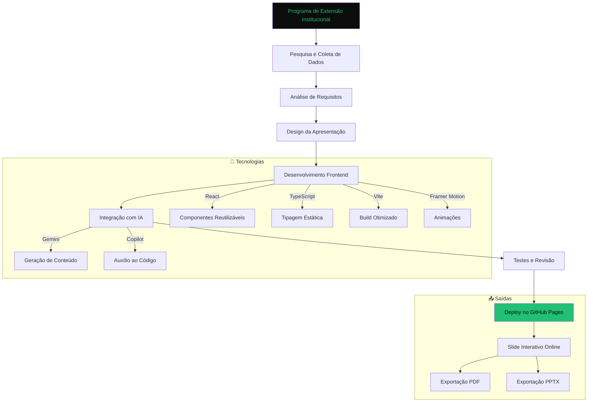
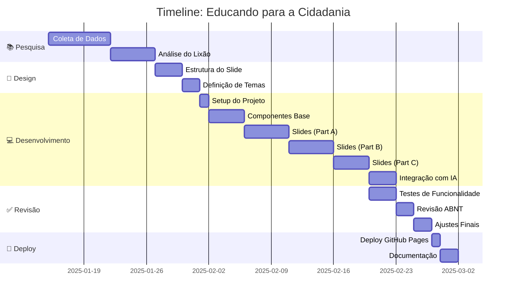

# 🎓 **Educando para a Cidadania: Transformação do Lixão da Estrutural (DF)**

> **📌 Projeto de Extensão Institucional | Unyleya (EAD) | Marcos Eduardo da Silva dos Reis**

[](https://github.com/MarcozEduardo/Programa-de-Extens-o-Institucional/blob/main/LICENSE.MD)
[](https://react.dev)
[](https://www.typescriptlang.org)
[](https://vitejs.dev)
[](https://www.framer.com/motion)
[](https://www.abnt.org.br)

---

## **📌 Sobre o Projeto**

Este é um **slide interativo online** desenvolvido como parte do **Programa de Extensão Institucional da Faculdade Unyleya (EAD)**, que aborda a **transformação do Lixão da Estrutural (DF)**. O projeto combina **conhecimentos acadêmicos** (ABNT, metodologia científica, gestão de projetos) com **tecnologias modernas de desenvolvimento web** e **Inteligência Artificial** para criar uma experiência de apresentação única e profissional.

| **✅ O que é?** | **→ Objetivo** | **📚 Público Alvo** |
|--------------------------|----------------------|----------------------|
| Slide interativo online | Demonstrar a transformação social e urbana do Lixão da Estrutural | Alunos, professores, gestores públicos e comunidade acadêmica |
| Apresentação acadêmica (ABNT) | Educar para a cidadania através de casos reais | Instituições de ensino e órgãos públicos |
| Ferramenta de visualização de dados | Mostrar impactos sociais e urbanos | Pesquisadores e formuladores de políticas |

---

## **🎬 Demo ao Vivo**

> **▶ [Acesse a Apresentação Interativa]([https://marcozeduardo.github.io/Programa-de-Extens-o-Institucional/](https://programa-de-extens-o-institucional.vercel.app/)**
Está alocada em um serve Vercel. confira

✅ **Funcionalidades:**
- 📤 Navegação por slides com **animações suaves** (Framer Motion)
- 🎨 **3 temas visuais** (Escuro, Claro, Aurora) 
- ⛶ **Modo tela cheia** e **grade de slides** (O)
- 📄 **Exportação para PDF** (impressão) e **PowerPoint (.pptx)**
- 🖼️ **Fotos reais** (Agência Brasil, Senado, GDF) com licenças ABNT
- 📱 **Responsivo** (funciona em desktop, tablet e mobile)
- ⌨️ **Controles por teclado** (setas, F para tela cheia, P para PDF)

---

## **🛠️ Tecnologias Utilizadas**

### **🖥️ Frontend**
| Tecnologia | Descrição | Versão |
|------------|------------|---------|
| **[React](https://react.dev)** | Biblioteca para construção de interfaces | 18+ |
| **[TypeScript](https://www.typescriptlang.org)** | Linguagem tipada para JavaScript | 5+ |
| **[Vite](https://vitejs.dev)** | Bundler rápido para desenvolvimento | 4+ |
| **[Framer Motion](https://www.framer.com/motion)** | Animações fluidas | 10+ |
| **[PptxGenJS](https://gitbrent.github.io/PptxGenJS/)** | Geração de PowerPoint (.pptx) | Latest |
| **[html-to-image](https://github.com/bubkoo/html-to-image)** | Captura de slides como imagens | Latest |
| **[Lucide React](https://lucide.dev)** | Ícones modernas e leves | Latest |

### **🤖 Ferramentas de IA**
| Ferramenta | Uso no Projeto |
|------------|---------------|
| **[Gemini (Google)](https://gemini.google.com)** | Geração de conteúdo, revisão de textos, sugestões de estrutura |
| **[GitHub Copilot](https://github.com/features/copilot)** | Auxílio na escrita de código (React, TypeScript) |
| **[Mermaid.js](https://mermaid.js.org)** | Criação de diagramas (usado neste README) |

### **📚 Metodologia Acadêmica**
- **ABNT NBR 14724**: Formatação de trabalhos acadêmicos
- **ABNT NBR 10520**: Citações em documentos
- **ABNT NBR 6023**: Referências bibliográficas

---

## **🏗️ Arquitetura do Projeto**



---

## **📅 Timeline do Desenvolvimento**



---

## **📁 Estrutura de Pastas**

```
Programa-de-Extens-o-Institucional/
├── public/                  # Assets estáticos
│   └── ...
├── src/
│   ├── components/          # Componentes React
│   │   ├── Deck.tsx         # Componente principal do slide
│   │   ├── ui/             # Componentes de UI (botões, modais)
│   │   └── ...
│   ├── slides/              # Todos os slides da apresentação
│   │   ├── index.tsx       # Índice de slides
│   │   ├── partA.tsx        # Slides 1-4 (Capa, Gestão, Problema, Histórico)
│   │   ├── partB.tsx        # Slides 5-7 (Ação, Impacto Social, Impacto Urbano)
│   │   ├── S08Campo.tsx     # Slide 8 (Pesquisa de Campo)
│   │   └── partC.tsx        # Slides 9-13 (Desenvolvimento, Testagem, etc.)
│   ├── data/                # Dados e mídias
│   │   ├── media.ts         # Fotos e metadados (ABNT)
│   │   └── ...
│   ├── utils/               # Funções utilitárias
│   ├── index.css            # Estilos globais
│   ├── main.tsx            # Ponto de entrada
│   └── App.tsx             # Componente raiz
├── index.html              # HTML principal
├── package.json            # Dependências
├── tsconfig.json           # Configuração TypeScript
├── vite.config.ts          # Configuração Vite
├── README.md               # Este arquivo
└── CASE-STUDY.md           # Estudo de Caso Detalhado
```

---

## **🚀 Como Rodar Localmente**

### **▶ Pré-requisitos**
- [Node.js](https://nodejs.org) (v18 ou superior)
- [Git](https://git-scm.com) (opcional)
- Navegador moderno (Chrome, Firefox, Edge)

### **⬇ Instalação**
```bash
# 1. Clone o repositório
 git clone https://github.com/MarcozEduardo/Programa-de-Extens-o-Institucional.git
 cd Programa-de-Extens-o-Institucional

# 2. Instale as dependências
 npm install

# 3. Inicie o servidor de desenvolvimento
 npm run dev
```

### **▶ Acesse a Apresentação**
Abra o navegador e vá para:
```
http://localhost:5173
```

---

## **🎯 Funcionalidades do Slide**

### **📜 Navegação**
| Ação | Teclas | Descrição |
|--------|--------|-------------|
| Próximo Slide | → / Espaço / PageDown | Avança para o próximo slide |
| Slide Anterior | ← / PageUp | Volta para o slide anterior |
| Início | Home | Vai para o primeiro slide |
| Fim | End | Vai para o último slide |
| Grade de Slides | O | Abre a grade de slides |
| Tela Cheia | F | Ativa o modo tela cheia |
| Exportar PDF | P | Abre o modo impressão/PDF |

### **🎨 Temas Visuais**
| Tema | Descrição | Ideal para |
|------|------------|-------------|
| **Escuro** | Fundo preto com gradientes verdes | Projeção em ambientes escuros |
| **Claro** | Fundo claro (papel) | Leitura e impressão (ABNT) |
| **Aurora** | Gradiente suave | Apresentações modernas |

### **📤 Exportação**
- **PDF**: Impressão em A4 paisagem (1 slide por página)
- **PowerPoint (.pptx)**: Baixe a apresentação completa com fotos
- **Imagens**: Captura de slides individuais

---

## **🤖 Como a IA Ajudou no Desenvolvimento**

### **💡 1. Geração de Conteúdo**
- **Gemini** foi usado para:
  - Redigir **textos acadêmicos** (introdução, conclusão)
  - Criar **descrições de slides** com base em tópicos
  - Gerar **legendas para fotos** (ABNT NBR 14724)
  - Traduzir e **revisar textos** para conformidade acadêmica

### **💡 2. Auxílio ao Código**
- **GitHub Copilot** ajudou em:
  - **Componentes React** (estrutura, props, hooks)
  - **Animações com Framer Motion** (transições, variants)
  - **Lógica de exportação** (PPTX, PDF)
  - **Funções utilitárias** (manipulação de dados, formatação)

### **💡 3. Design e UX**
- **Sugestões de layout** para slides
- **Paleta de cores** baseada em temas acadêmicos
- **Estrutura de navegação** (teclado, mouse, touch)

### **💡 4. Documentação**
- **Geração de README.md** (este arquivo!)
- **Criação de CASE-STUDY.md** (estudo de caso detalhado)
- **Diagramas Mermaid** (fluxogramas, timeline)

---

## **💭 O que Aprendi com Este Projeto**

### **🧩 Conhecimentos Técnicos**
- **React + TypeScript**: Construção de aplicações complexas com tipagem forte
- **Framer Motion**: Animações suaves e interações fluidas
- **Vite**: Configuração de build e otimização de performance
- **PptxGenJS**: Geração dinâmica de PowerPoint
- **html-to-image**: Captura de elementos HTML como imagens

### **📚 Metodologia de Desenvolvimento**
- **ABNT**: Aplicação de normas acadêmicas em projetos digitais
- **GitHub Pages**: Deploy contínuo e gratuito
- **Componentização**: Organização de código modular
- **Responsividade**: Adaptação para todos os dispositivos

### **🤖 Integração com IA**
- **Prompt Engineering**: Como criar prompts efetivos para IA
- **Revisão de Código**: Uso de IA para melhorar qualidades de código
- **Geração de Conteúdo**: Automação de textos acadêmicos
- **Documentação Automática**: Criação de documentação com IA

---

## **🤝 Contribuições**

Contribuições são bem-vindas! Sinta-se à vontade para:
- ✅ Reportar bugs
- ✅ Sugerir melhorias
- ✅ Adicionar novos recursos
- ✅ Melhorar a documentação

### **📥 Como Contribuir**
1. Fork o repositório
2. Crie uma branch (`git checkout -b feature/nova-feature`)
3. Commit suas mudanças (`git commit -m 'Adiciona nova feature'`)
4. Push para a branch (`git push origin feature/nova-feature`)
5. Abra um Pull Request

---

## **🙏 Agradecimentos**

- **Unyleya (EAD)**: Pela oportunidade de desenvolvimento acadêmico e profissional
- **Agência Brasil, Senado e GDF**: Pelas fotos com licenças livres (CC BY)
- **Comunidade Open Source**: Pelas tecnologias incríveis usadas neste projeto
- **Google (Gemini)**: Pelo suporte na geração de conteúdo e código
- **GitHub**: Pela plataforma de versionamento e CI/CD

---

## **👤 Autor**

| [Marcos Eduardo da Silva dos Reis](https://github.com/MarcozEduardo) |
|-------------------------------------------------------------------------|
| 👨‍💻 **Desenvolvedor Full-Stack & Orquestrador de IA** |
| ✉️ **Email**: [marcos.eduardo.reis@outlook.com](mailto:marcos.eduardo.reis@outlook.com) |
| 🌐 **Portfólio**: [Render Nexus](https://marcozeduardo.github.io) |
| 🔗 **LinkedIn**: [Marcos Eduardo Reis](https://www.linkedin.com/in/marcos-eduardo-reis/) |

---

## **🔗 Links Úteis**

- 🔗 **[Apresentação ao Vivo](https://marcozeduardo.github.io/Programa-de-Extens-o-Institucional/)**
- 📄 **[CASE STUDY Detalhado](https://github.com/MarcozEduardo/Programa-de-Extens-o-Institucional/blob/main/CASE-STUDY.md)**
- 🐙 **[Repositório no GitHub](https://github.com/MarcozEduardo/Programa-de-Extens-o-Institucional)**
- 📚 **[ABNT NBR 14724](https://www.abnt.org.br)** (Normas para trabalhos acadêmicos)
- 📚 **[React Docs](https://react.dev)** (Documentação oficial)
- 📚 **[Framer Motion](https://www.framer.com/motion/)** (Animações)
- 📚 **[Vite Docs](https://vitejs.dev)** (Bundler)

---

> **❤️ Feito com ❤️, React e IA | © 2025 Marcos Eduardo da Silva dos Reis**

> **🚀 Este projeto é parte do portfólio [Render Nexus](https://marcozeduardo.github.io) - Orquestrando IA Generativa**
